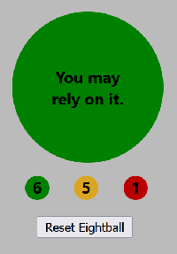

# sb_39-04-11-react-state-exercise-eight-ball

## Assignment Details

Build a simulation of the [Magic Eight Ball](https://shop.mattel.com/shop/en-us/ms/magic-8-ball-retro-style-dhw39) toy with React.

Initially, the Eight Ball has a black background color and "Think of a question" is initially displayed. Once you think of a question, clicking on the Magic Eight Ball magically reveals the answer to your question. 



The color of the Eight Ball also changes to match the mood of the answer -- green is typically for happy 'yes', goldenrod is for 'maybe' type answers and red is typically no. Magic Eight Ball is initially programmed with 20 answers.

 
## Technology Stack
- **Front-end**: ReactJS
- **Back-end**: n/a


## Additional Details

**Enhancements**
- **Further Study 1** *reset* and *record keeping* enhancements added to the Magic Eight Ball. An object was created to hold the three colors, the number of times the color appeared and the function name to update the number of times the color appeared. 
```
    const idx = getRandomIdx(answers.length);
    ...
    const ctrs = {
        green: {
            ctr: eightBallCtrGreen,
            fx: setEightBallCtrGreen
        },
        goldenrod: {
            ctr: eightBallCtrGoldenrod,
            fx: setEightBallCtrGoldenrod
        },
        red: {
            ctr: eightBallCtrRed,
            fx: setEightBallCtrRed
        }
    }
    ...
    const newColor = answers[idx].color;
    const currCtr = ctrs[newColor]["ctr"];
    ctrs[newColor]["fx"](currCtr + 1);
```
An object was chosen as a better way to update the color stats than have if green / else if goldenrod / else red logic.


**Difficulties**
- Even with React, page layout and CSS with components not aligning as expected continue to annoy and eat up time! The issues probably related to 
`position: absolute` on the `.EightBall-Main` class in order to get the message centered on the Eight Ball with the message class
...
.EightBall-Msg {
    margin: 0;
    position: absolute;
    top: 50%;
    left: 50%;
    -ms-transform: translate(-50%, -50%);
    transform: translate(-50%, -50%);
}
```
It all looked great until the reset button and stats were added. The 'workaround' was to create a div with a 350px top margin to force it below the Eight Ball. It is bothersome because just because it works does not make it right. BUT the stats are there and no special formatting was needed to get the numbers centered. The 'centering' of the button and counters was accomplished by manipulating margins.

